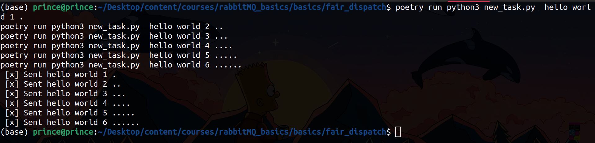
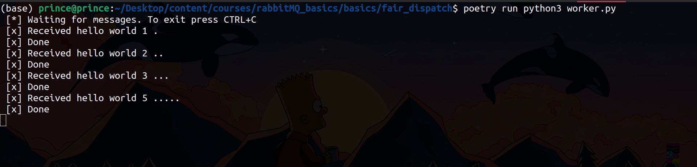
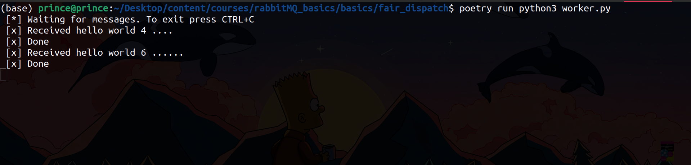

You may have noticed that the way messages are being distributed isn't ideal. For example, if you have two workers and the odd-numbered messages are more complex while the even ones are simpler, one worker could end up overloaded, while the other has little to do. RabbitMQ doesn't take this into account and continues to send messages evenly across workers.

This occurs because RabbitMQ dispatches messages as soon as they enter the queue, without considering how many unacknowledged messages each worker has. It simply assigns every n-th message to the n-th worker, regardless of whether that worker is still processing a previous message.

To improve this, you can use the `basic_qos` method with the `prefetch_count=1` setting on the channel. This setting tells RabbitMQ to only send one message at a time to each worker, ensuring that a worker won’t receive another message until it has finished and acknowledged the current one. This way, RabbitMQ will send the next message to an available worker rather than piling up tasks on one worker.


## Code Run

**Terminal 01:**

One the first terminal and run the task script

```terminal
poetry run python3 new_task.py  hello world 1 .
poetry run python3 new_task.py  hello world 2 ..
poetry run python3 new_task.py  hello world 3 ...
poetry run python3 new_task.py  hello world 4 ....
poetry run python3 new_task.py  hello world 5 .....
poetry run python3 new_task.py  hello world 6 ......
```



**Terminal 02:**

While the code still is running for the task script, start a new terminal and run the script to start the first worker.

```terminal
poetry run python3 worker.py
```

This will force all the tasks to being allocated to this workers, to really see the effect of fair distribution, we'll have to run the next worker. 

Since one task will be allocated to the current agent untill it completes the allocated task, starting a new worker will lead to the unallocated tasks to be allocate to the new worker without overwhelming the initial worker.




**Terminal 03:**

```terminal
poetry run python3 worker.py
```

