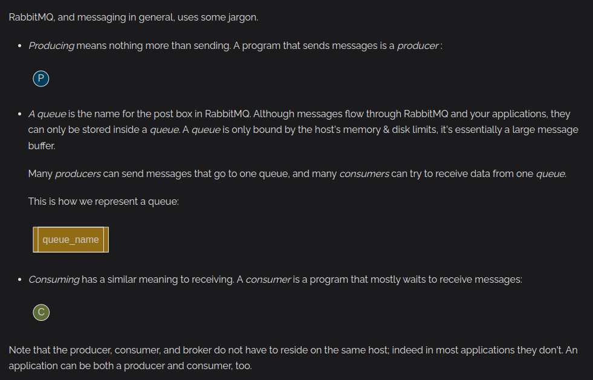

## Fundamental Concepts



## Running Your Application

Before running your application, make sure to first start the RabbitMQ server using docker-compose file created.

```yml
version: "3.2"
services:
  rabbitmq:
    image: rabbitmq:3-management-alpine
    container_name: 'rabbitmq'
    ports:
        - 5672:5672
        - 15672:15672
    volumes:
        - ~/.docker-conf/rabbitmq/data/:/var/lib/rabbitmq/
        - ~/.docker-conf/rabbitmq/log/:/var/log/rabbitmq
    networks:
        - rabbitmq_go_net

networks:
  rabbitmq_go_net:
    driver: bridge
```

### Commands to use

```terminal
docker-compose up -d
docker-compose down
```

NOTE: It's important to wait for like 30 seconds to 1 minute for the server to load up before you start running your Python scripts.

## Alternative To Docker Compose File

```terminal
# latest RabbitMQ 3.13
docker run -it --rm --name rabbitmq -p 5672:5672 -p 15672:15672 rabbitmq:3.13-management
```