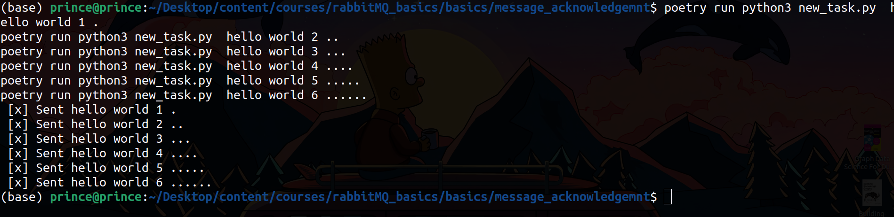
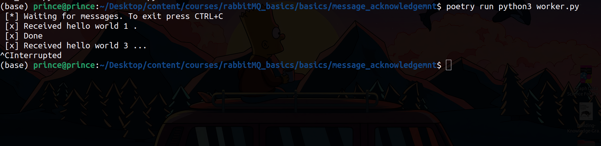
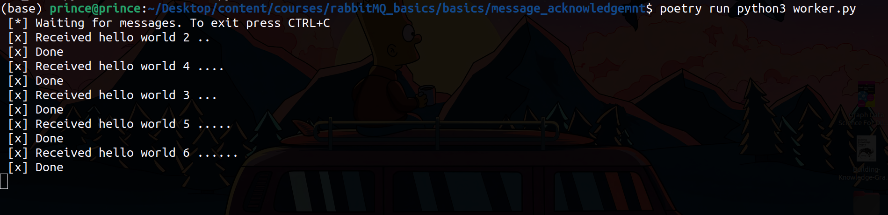

## Message Acknowledgement

send an acknowledgment aka ack to let the consumer know  that the message has been received, processed and can be  removed from the queue.

If not acknowledged, the message will be requeued and sent to another consumer. This way, if a consumer dies, the message will not be lost but will be sent to another consumer. Hence, the message will be processed and not lost.

By default the timeout for the acknowledgment is 30 minutes. The timeout can be changed by setting the heartbeat parameter

This way even if the consumer dies, while processing the message, the message will be sent to another consumer and will be processed.

All acknowledgments are sent on the same channel that received the delivery. It's important to note that acknowledgments are not sent on a separate channel. This will lead to a channel-level protocol exception.

Failure to acknowledge a message can lead to messages being redelivered over and over again to the consumer. This is why it's important to handle the acknowledgment process properly. The more the message is redelivered,  the more memory and CPU will be used. As it won't be able to release any unacknowledged messages.

### To Test This out

**Terminal 01:**

```terminal
poetry run pyton3 worker.py
```

**Terminal 02:**

```terminal
poetry run pyton3 worker.py
```

**Terminal 02:**

```terminal
poetry run python3 new_task.py  hello world 1 .
poetry run python3 new_task.py  hello world 2 ..
poetry run python3 new_task.py  hello world 3 ...
poetry run python3 new_task.py  hello world 4 ....
poetry run python3 new_task.py  hello world 5 .....
poetry run python3 new_task.py  hello world 6 ......
```



I started the first worker and then stopped it using `CTRL + C` to stop it after it was done with task 01 and stopped it just before it completed task 3 it was allocated.



The second task that was not completed in task one above gets redelivered to the second worker



Hence do task was lost.