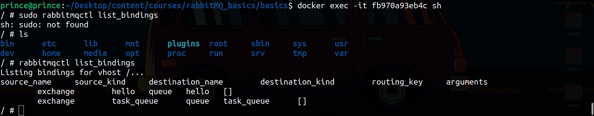
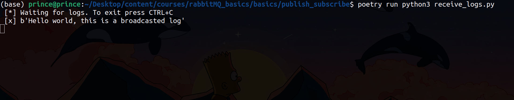
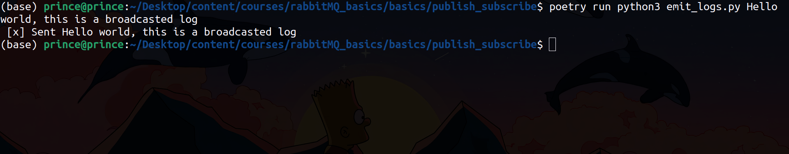
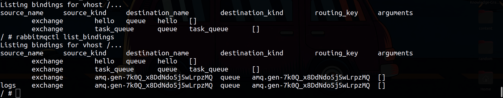

## Getting Docker Container ID

```terminal
docker ps -a
```

From the output of this, identify the container ID of the docker container.

## Iteractive Shell In Docker Container

To enter an interactive shell on the docker container's ID you have identified from above, use the following commands eg:

```terminal
docker exec -it fb970a93eb4c sh
```

This should give you access to the docker container's shell.


## Listing Existing Bindings

To list the existing bindings that are available, use the command below:

```terminal
rabbitmqctl list_bindings
```



## Starting Workers

Let's now start two workers, each will have a different queue name that is randomly generated by RabbitMQ, as we talked.

**Terminal 01:**

This will log into a log file as specified below.

```terminal
poetry run python3 receive_log.py > log_from_receiver.log
```

**Terminal 02:**

This will output the logs onto the screen

```terminal
poetry run python3 receive_log.py
```




**Terminal 03:**

Finally we emit the actual logs

```terminal
poetry run python3 emit_logs.py
```




## Listings Of Bindings After



From the image you can see the other created queues that are bound to the  `fanout` `log` exchange