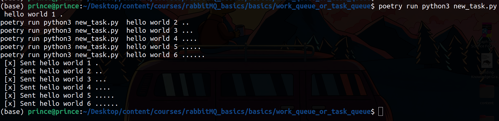
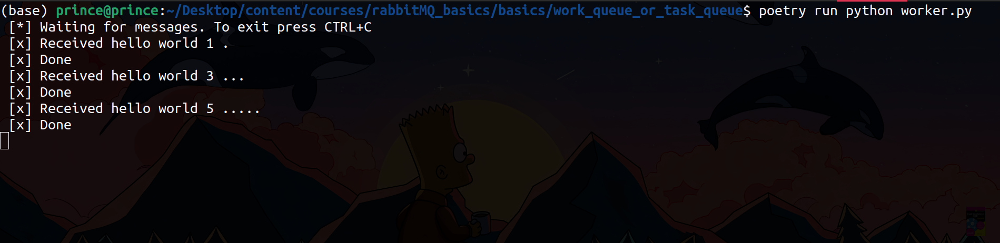
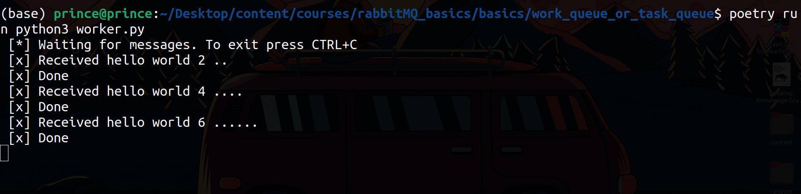

## Task Queues

One of the advantages of using a Task Queue is the ability to easily parallelise work. If we are building up a backlog of work, we can just add more workers and that way, scale easily.


By default, RabbitMQ will send each message to the next consumer, in sequence. On average every consumer will get the same number of messages. This way of distributing messages is called round-robin. Try this out with three or more workers.

## Round-robin dispatching

By default RabbitMQ uses Round-robin, tasks are distributed equally across different workers.

To see this in action, start two workers in two different terminals

**Terminal One:**

```terminal
poetry run pyton3 worker.py
```

**Terminal Two:**

```terminal
poetry run pyton3 worker.py
```

Then run task process on one other terminal

```terminal
poetry run python3 new_task.py  hello world 1 .
poetry run python3 new_task.py  hello world 2 ..
poetry run python3 new_task.py  hello world 3 ...
poetry run python3 new_task.py  hello world 4 ....
poetry run python3 new_task.py  hello world 5 .....
poetry run python3 new_task.py  hello world 6 ......
```

We have 6 different tasks, this should be distributed evenly amongst all the different workers we have running.


**Tasks Terminal**



**Worker Terminal 1**




**Worket Terminal 2**

